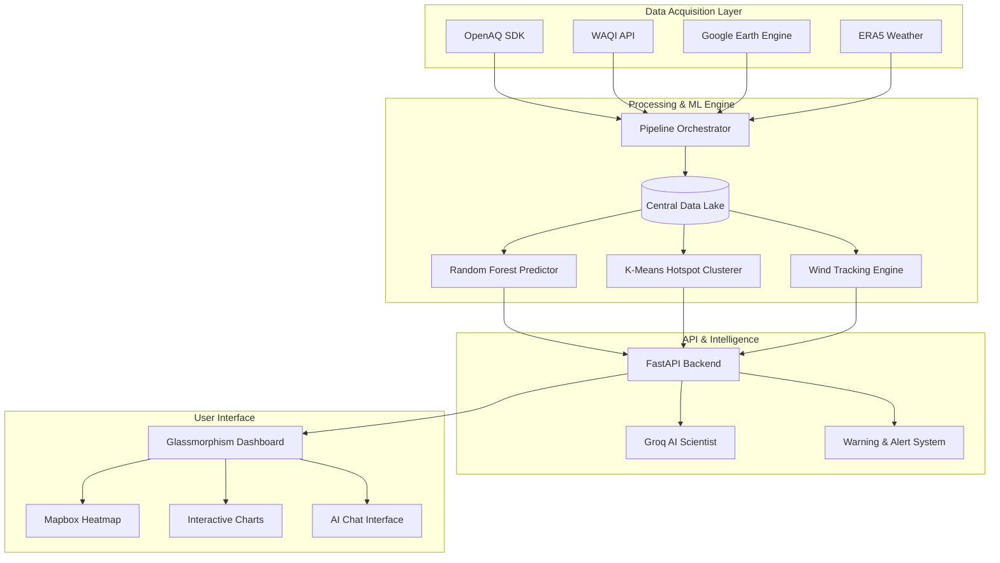

# 🌍 AI AirAware Pro: Advanced Pollution Monitoring & Intelligence

**AirAware Pro** is a sophisticated, full-stack environmental intelligence platform. It bridges the gap between raw environmental data and actionable public health insights by fusing ground-level sensor networks, satellite imagery, and high-resolution meteorological models.


---

## 🌟 Vision & Impact (NSS Initiative)
Developed as a **National Service Scheme (NSS)** flagship project, AirAware Pro aims to democratize air quality data. While traditional systems provide raw numbers, our platform provides **context**—helping citizens understand not just *what* the pollution levels are, but *why* they are changing and *how* to stay safe.

---

## 🚀 Key Features in Detail

### 📊 1. Multi-Source Data Fusion
Most systems rely on a single source. AirAware Pro aggregates data from:
- **Ground Sensors (WAQI & OpenAQ)**: Real-time PM2.5 and PM10 readings from CPCB and international stations.
- **Satellite Eyes (Sentinel-5P)**: Space-borne measurements of Columnar NO₂, SO₂, and CO for areas without ground sensors.
- **Meteorological Data (ERA5)**: High-resolution wind vectors and precipitation data from the European Centre for Medium-Range Weather Forecasts (ECMWF).

### 🧠 2. Deep Intelligence Engine
The system doesn't just display data; it analyzes it:
- **Hotspot Ranking**: Uses **K-Means Clustering** to automatically group cities into "High Impact Zones," allowing authorities to prioritize interventions.
- **Predictive Modelling**: A **Random Forest Regressor** trained on historical records allows users to click anywhere on the map to get an AI-estimated pollution value for that coordinate.
- **Trend Analysis**: Tracks the persistence of pollutants over time.

### 🌬️ 3. Dynamic Pollution Tracking
Our "Movement" engine uses live wind data to calculate:
- **Dispersion Vectors**: Visualizes where pollution is likely to drift in the next 3-6 hours.
- **Stagnation Alerts**: Identifies regions with low wind speeds where pollutants are likely to accumulate to dangerous levels.
- **Washout Effects**: Detects active rainfall and calculates its impact on clearing particulate matter (PM2.5).

### 💬 4. Groq-Powered AI Scientist
Integrated with the **Llama 3 (70B) model via Groq**, our "Air Scientist" isn't a generic chatbot. It has **real-time context** of your local air quality and provide:
- Hyper-local health advice (e.g., "High NO2 detected near you; avoid cardio outdoors today").
- Technical explanations of AQI dynamics.
- Data-driven summaries of regional trends.

---

## 🏗️ System Architecture



---

## ⚙️ Installation & Usage

### 1. Requirements
- **Python 3.13+**
- Active API keys for Mapbox, WAQI, OpenAQ, and Groq.

### 2. Environment Setup
Create a `.env` file in the root directory:
```env
MAPBOX_ACCESS_TOKEN=your_token
WAQI_API_TOKEN=your_token
OPENAQ_API_KEY=your_key
GROQ_API_KEY=your_key
```

### 3. Execution Flow
```bash
# Install dependencies
pip install -r requirements.txt

# Step 1: Initialize the data pipeline (Fetches & Merges all sources)
python src/data_collection/fetch_all_gases.py

# Step 2: Start the high-performance backend
python api/main.py
```

---

## 📂 Repository Roadmap

- `api/`: RESTful endpoints for real-time data, ML predictions, and AI chat.
- `src/models/`: Implementation of Scikit-Learn pipelines for hotspot detection and prediction.
- `src/data_collection/`: Robust multi-threaded fetchers for environmental data.
- `dashboard/`: A premium, responsive UI featuring modern glassmorphism and real-time Mapbox layers.
- `docs/`: In-depth documentation on methodology and data sourcing.

---
**Developed by Vinay Sai** | *Advancing Environmental Intelligence for a Greener India*
